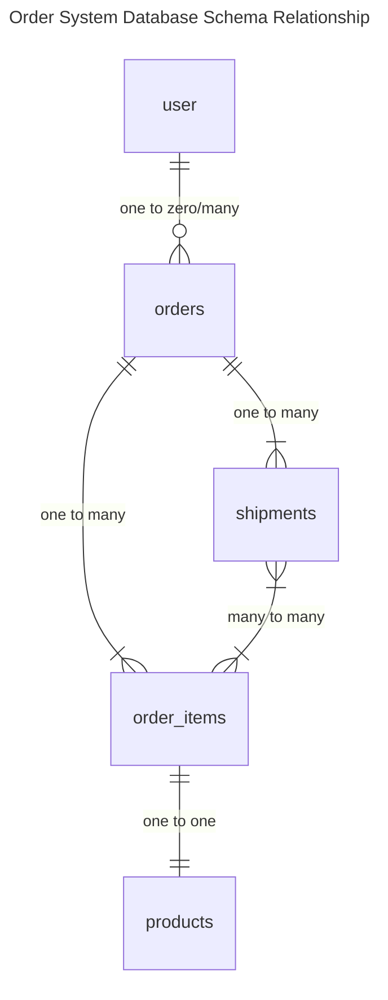

# Order System

## API

### New orders from official website

POST /order

### Update order

PUT /order/:id

### Delete order

DELETE /order/:id

### Get orders

GET /order

## Database schema relationship

