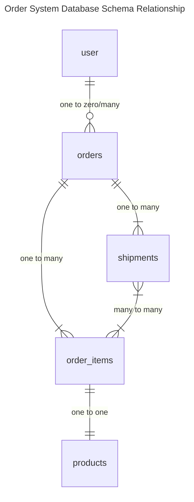

# Order System

## 目錄

- [API 規格](#api-規格)
    - [建立與匯入訂單](#建立與匯入訂單)
- [資料表關係圖](#資料表關係圖)

## API 規格

### 建立與匯入訂單

POST /api/order

#### Request Parameter

| 參數名稱 | required | 資料型態 | 描述 |
| -- | -- | -- | -- |
| channel | 是 | string | 銷售渠道 |
| data | 是 | array | 訂單資料 |
| &nbsp;&nbsp;&nbsp;&nbsp; order_number | 是 | string | 訂單編號 |
| &nbsp;&nbsp;&nbsp;&nbsp; recipient_name |  | string | 收件人姓名 |
| &nbsp;&nbsp;&nbsp;&nbsp; recipient_email |  | string | 收件人信箱 |
| &nbsp;&nbsp;&nbsp;&nbsp; recipient_phone |  | string | 收件人電話 |
| &nbsp;&nbsp;&nbsp;&nbsp; shipping_address | 是 | string | 寄送地址 |
| &nbsp;&nbsp;&nbsp;&nbsp; scheduled_shipping_date |  | string<br>(Y-m-d) | 預計寄送日期 |
| &nbsp;&nbsp;&nbsp;&nbsp; remark |  | string | 備註 |
| &nbsp;&nbsp;&nbsp;&nbsp; ordered_at | 是 | string<br>(Y-m-d H:i:s) | 訂購日期 |
| &nbsp;&nbsp;&nbsp;&nbsp; shipments | 是 | array | 出貨單列表 |
| &nbsp;&nbsp;&nbsp;&nbsp;&nbsp;&nbsp;&nbsp;&nbsp;&nbsp; shipment_number | 是 | string | 出貨單號 |
| &nbsp;&nbsp;&nbsp;&nbsp;&nbsp;&nbsp;&nbsp;&nbsp;&nbsp; courier | 是 | string | 快遞公司 |
| &nbsp;&nbsp;&nbsp;&nbsp;&nbsp;&nbsp;&nbsp;&nbsp;&nbsp; tracking_number | 是 | string | 快遞追蹤碼 |
| &nbsp;&nbsp;&nbsp;&nbsp;&nbsp;&nbsp;&nbsp;&nbsp;&nbsp; remark |  | string | 備註 |
| &nbsp;&nbsp;&nbsp;&nbsp;&nbsp;&nbsp;&nbsp;&nbsp;&nbsp; items | 是 | array | 品項列表 |
| &nbsp;&nbsp;&nbsp;&nbsp;&nbsp;&nbsp;&nbsp;&nbsp;&nbsp;&nbsp;&nbsp;&nbsp;&nbsp;&nbsp; product_id | 是 | int | 商品 id |
| &nbsp;&nbsp;&nbsp;&nbsp;&nbsp;&nbsp;&nbsp;&nbsp;&nbsp;&nbsp;&nbsp;&nbsp;&nbsp;&nbsp; sku | 是 | string | sku |
| &nbsp;&nbsp;&nbsp;&nbsp;&nbsp;&nbsp;&nbsp;&nbsp;&nbsp;&nbsp;&nbsp;&nbsp;&nbsp;&nbsp; quantity | 是 | int | 數量 |

#### Response

##### 201 創建成功

### 更新訂單

PUT /api/order/:id

#### Request Parameter

| 參數名稱 | required | 資料型態 | 描述 |
| -- | -- | -- | -- |
| recipient_name |  | string | 收件人名字 |
| recipient_email |  | string | 收件人信箱 |
| recipient_phone |  | string | 收件人電話 |
| shipping_address |  | string | 寄送地址 |
| scheduled_shipping_date |  | string<br>(Y-m-d) | 預計寄送時間 |
| status |  | int | 訂單狀態 |
| remark |  | string | 備註 |
| shipments |  | array | 出貨單列表 |
| &nbsp;&nbsp;&nbsp;&nbsp; id |  | int | 出貨單 id |
| &nbsp;&nbsp;&nbsp;&nbsp; shipment_number |  | string | 出貨單號 |
| &nbsp;&nbsp;&nbsp;&nbsp; courier |  | string | 快遞公司 |
| &nbsp;&nbsp;&nbsp;&nbsp; tracking_number |  | string | 快遞追蹤碼 |
| &nbsp;&nbsp;&nbsp;&nbsp; status |  | int | 出貨單狀態 |
| &nbsp;&nbsp;&nbsp;&nbsp; shipped_at |  | string<br>(Y-m-d H:i:s) | 配送日期 |
| &nbsp;&nbsp;&nbsp;&nbsp; delivered_at |  | string<br>(Y-m-d H:i:s) | 送達日期 |
| &nbsp;&nbsp;&nbsp;&nbsp; remark |  | string | 備註 |
| &nbsp;&nbsp;&nbsp;&nbsp; items |  | array | 品項列表 |
| &nbsp;&nbsp;&nbsp;&nbsp;&nbsp;&nbsp;&nbsp;&nbsp;&nbsp; id |  | int | 品項 id |
| &nbsp;&nbsp;&nbsp;&nbsp;&nbsp;&nbsp;&nbsp;&nbsp;&nbsp; quantity |  | int | 數量 |

* 想像上訂單更新只能調整出貨單的內容，無法調整訂單品項，因此只允許調整出貨單內的品項 id 與數量

#### Response

##### 200 成功

```json
{
    "data": {
        "id": 2,
        "channel": "amazon",
        "order_number": "e11ba445-381a-4168-984c-e028a691e0e5",
        "user_id": null,
        "recipient_name": "Jeanette Bartell",
        "recipient_email": null,
        "recipient_phone": null,
        "shipping_address": "0344 Hirthe Locks",
        "scheduled_shipping_date": null,
        "status": 1,
        "total_amount": "150.00",
        "shipping_fee": "0.00",
        "discount": "0.00",
        "discount_rate": "0.00",
        "remark": null,
        "ordered_at": "2020-01-01 00:00:00",
        "created_at": "2025-01-14T02:56:24.000000Z",
        "updated_at": "2025-01-14T03:06:17.000000Z",
        "shipments": [
            {
                "id": 3,
                "order_id": 2,
                "courier": "DHL",
                "shipment_number": "c4f23c3a-8a69-48bd-82d9-b3e8e0d3a455",
                "tracking_number": "22b431e7-9399-4381-a37e-8c3083a0a2ab",
                "status": 0,
                "shipped_at": null,
                "delivered_at": null,
                "remark": null,
                "created_at": "2025-01-14T02:56:24.000000Z",
                "updated_at": "2025-01-14T02:56:24.000000Z",
                "order_items": [
                    {
                        "id": 5,
                        "order_id": 2,
                        "product_id": 3,
                        "product_name": "Rustic Cotton Car",
                        "sku": "37aa8908-feab-4c0f-9206-11fdc7c8b0e8",
                        "price": "150.00",
                        "quantity": 1,
                        "total": "150.00",
                        "created_at": "2025-01-14T02:56:24.000000Z",
                        "updated_at": "2025-01-14T02:56:24.000000Z",
                        "pivot": {
                            "shipment_id": 3,
                            "order_item_id": 5,
                            "quantity": 1,
                            "created_at": "2025-01-14T02:56:24.000000Z",
                            "updated_at": "2025-01-14T02:56:24.000000Z"
                        }
                    }
                ]
            }
        ]
    }
}
```

##### 404 無資料

```json
{
    "error": "Data not found exception.",
    "error_code": "E001004",
    "error_description": "Order not found: 4"
}
```

### 刪除訂單

DELETE /api/order/:id

#### Response

##### 204 成功

### 取得訂單清單

GET /api/order

#### Request Parameter

| 參數名稱 | required | 資料型態 | 描述 |
| -- | -- | -- | -- |
| page |  | int | 頁數，最小值為 1 ，預設為 1 |
| limit |  | int | 單次搜尋資料數，最小值為 1 ，最大值為 50 ，預設為 50 |
| start_time |  | string<br>(Y-m-d H:i:s) | 訂單下訂時間起始範圍 |
| end_time |  | string<br>(Y-m-d H:i:s) | 訂單下訂時間結束範圍 |
| status |  | int | 訂單狀態 |
| channel |  | string | 銷售渠道 |
| order_number |  | string | 訂單編號 |

#### Response

##### 200 成功

```json
{
    "data": [
        {
            "id": 1,
            "channel": "amazon",
            "order_number": "58b0fb37-2483-44a0-9994-23bd59c053fb",
            "user_id": null,
            "recipient_name": "收件人",
            "recipient_email": "whatever@test.com",
            "recipient_phone": "+886912345678",
            "shipping_address": "寄送地址",
            "scheduled_shipping_date": "3000-01-01",
            "status": 0,
            "total_amount": "1550.00",
            "ordered_at": "2020-01-01 00:00:00",
            "shipments": [
                {
                    "id": 1,
                    "order_id": 1,
                    "courier": "新竹貨運",
                    "shipment_number": "ca78c77f-6c54-4d83-b972-6e38548e4b2c",
                    "tracking_number": "b1e2b3bc-49ba-4f4c-91aa-11f63b107b1b",
                    "status": 0,
                    "shipped_at": null,
                    "delivered_at": null,
                    "remark": null,
                    "created_at": "2025-01-14T02:56:24.000000Z",
                    "updated_at": "2025-01-14T02:56:24.000000Z",
                    "order_items": [
                        {
                            "id": 1,
                            "order_id": 1,
                            "product_id": 1,
                            "product_name": "Ergonomic Plastic Shirt",
                            "sku": "35063ad2-77eb-4c62-8870-13ddf74b4d74",
                            "price": "50.00",
                            "quantity": 10,
                            "total": "500.00",
                            "created_at": "2025-01-14T02:56:24.000000Z",
                            "updated_at": "2025-01-14T02:56:24.000000Z",
                            "pivot": {
                                "shipment_id": 1,
                                "order_item_id": 1,
                                "quantity": 10,
                                "created_at": "2025-01-14T02:56:24.000000Z",
                                "updated_at": "2025-01-14T02:56:24.000000Z"
                            }
                        },
                        {
                            "id": 2,
                            "order_id": 1,
                            "product_id": 1,
                            "product_name": "Ergonomic Plastic Shirt",
                            "sku": "35063ad2-77eb-4c62-8870-13ddf74b4d74",
                            "price": "50.00",
                            "quantity": 5,
                            "total": "250.00",
                            "created_at": "2025-01-14T02:56:24.000000Z",
                            "updated_at": "2025-01-14T02:56:24.000000Z",
                            "pivot": {
                                "shipment_id": 1,
                                "order_item_id": 2,
                                "quantity": 5,
                                "created_at": "2025-01-14T02:56:24.000000Z",
                                "updated_at": "2025-01-14T02:56:24.000000Z"
                            }
                        }
                    ]
                },
                {
                    "id": 2,
                    "order_id": 1,
                    "courier": "黑喵",
                    "shipment_number": "57d8d10b-aa5e-4ea6-8633-ac4d18eec9a8",
                    "tracking_number": "b9a9fcd6-e265-4900-9294-c59f6fd08f35",
                    "status": 0,
                    "shipped_at": null,
                    "delivered_at": null,
                    "remark": null,
                    "created_at": "2025-01-14T02:56:24.000000Z",
                    "updated_at": "2025-01-14T02:56:24.000000Z",
                    "order_items": [
                        {
                            "id": 3,
                            "order_id": 1,
                            "product_id": 1,
                            "product_name": "Ergonomic Plastic Shirt",
                            "sku": "35063ad2-77eb-4c62-8870-13ddf74b4d74",
                            "price": "50.00",
                            "quantity": 2,
                            "total": "100.00",
                            "created_at": "2025-01-14T02:56:24.000000Z",
                            "updated_at": "2025-01-14T02:56:24.000000Z",
                            "pivot": {
                                "shipment_id": 2,
                                "order_item_id": 3,
                                "quantity": 2,
                                "created_at": "2025-01-14T02:56:24.000000Z",
                                "updated_at": "2025-01-14T02:56:24.000000Z"
                            }
                        },
                        {
                            "id": 4,
                            "order_id": 1,
                            "product_id": 2,
                            "product_name": "Rustic Steel Table",
                            "sku": "5b8878cd-5b98-47fe-839e-dfda95a96548",
                            "price": "700.00",
                            "quantity": 1,
                            "total": "700.00",
                            "created_at": "2025-01-14T02:56:24.000000Z",
                            "updated_at": "2025-01-14T02:56:24.000000Z",
                            "pivot": {
                                "shipment_id": 2,
                                "order_item_id": 4,
                                "quantity": 1,
                                "created_at": "2025-01-14T02:56:24.000000Z",
                                "updated_at": "2025-01-14T02:56:24.000000Z"
                            }
                        }
                    ]
                }
            ]
        },
        {
            "id": 2,
            "channel": "amazon",
            "order_number": "e11ba445-381a-4168-984c-e028a691e0e5",
            "user_id": null,
            "recipient_name": "Jeanette Bartell",
            "recipient_email": null,
            "recipient_phone": null,
            "shipping_address": "0344 Hirthe Locks",
            "scheduled_shipping_date": null,
            "status": 0,
            "total_amount": "150.00",
            "ordered_at": "2020-01-01 00:00:00",
            "shipments": [
                {
                    "id": 3,
                    "order_id": 2,
                    "courier": "DHL",
                    "shipment_number": "c4f23c3a-8a69-48bd-82d9-b3e8e0d3a455",
                    "tracking_number": "22b431e7-9399-4381-a37e-8c3083a0a2ab",
                    "status": 0,
                    "shipped_at": null,
                    "delivered_at": null,
                    "remark": null,
                    "created_at": "2025-01-14T02:56:24.000000Z",
                    "updated_at": "2025-01-14T02:56:24.000000Z",
                    "order_items": [
                        {
                            "id": 5,
                            "order_id": 2,
                            "product_id": 3,
                            "product_name": "Rustic Cotton Car",
                            "sku": "37aa8908-feab-4c0f-9206-11fdc7c8b0e8",
                            "price": "150.00",
                            "quantity": 1,
                            "total": "150.00",
                            "created_at": "2025-01-14T02:56:24.000000Z",
                            "updated_at": "2025-01-14T02:56:24.000000Z",
                            "pivot": {
                                "shipment_id": 3,
                                "order_item_id": 5,
                                "quantity": 1,
                                "created_at": "2025-01-14T02:56:24.000000Z",
                                "updated_at": "2025-01-14T02:56:24.000000Z"
                            }
                        }
                    ]
                }
            ]
        }
    ],
    "page": 1,
    "limit": 50,
    "count": 2
}
```

##### 200 無資料

```json
{
    "data": [],
    "page": 1,
    "limit": 50,
    "count": 0
}
```

### 取得指定的訂單

GET /api/order/:id

#### Response

##### 200 成功

```json
{
    "data": {
        "id": 2,
        "channel": "amazon",
        "order_number": "e11ba445-381a-4168-984c-e028a691e0e5",
        "user_id": null,
        "recipient_name": "Jeanette Bartell",
        "recipient_email": null,
        "recipient_phone": null,
        "shipping_address": "0344 Hirthe Locks",
        "scheduled_shipping_date": null,
        "status": 0,
        "total_amount": "150.00",
        "shipping_fee": "0.00",
        "discount": "0.00",
        "discount_rate": "0.00",
        "remark": null,
        "ordered_at": "2020-01-01 00:00:00",
        "created_at": "2025-01-14T02:56:24.000000Z",
        "updated_at": "2025-01-14T02:56:24.000000Z",
        "shipments": [
            {
                "id": 3,
                "order_id": 2,
                "courier": "DHL",
                "shipment_number": "c4f23c3a-8a69-48bd-82d9-b3e8e0d3a455",
                "tracking_number": "22b431e7-9399-4381-a37e-8c3083a0a2ab",
                "status": 0,
                "shipped_at": null,
                "delivered_at": null,
                "remark": null,
                "created_at": "2025-01-14T02:56:24.000000Z",
                "updated_at": "2025-01-14T02:56:24.000000Z",
                "order_items": [
                    {
                        "id": 5,
                        "order_id": 2,
                        "product_id": 3,
                        "product_name": "Rustic Cotton Car",
                        "sku": "37aa8908-feab-4c0f-9206-11fdc7c8b0e8",
                        "price": "150.00",
                        "quantity": 1,
                        "total": "150.00",
                        "created_at": "2025-01-14T02:56:24.000000Z",
                        "updated_at": "2025-01-14T02:56:24.000000Z",
                        "pivot": {
                            "shipment_id": 3,
                            "order_item_id": 5,
                            "quantity": 1,
                            "created_at": "2025-01-14T02:56:24.000000Z",
                            "updated_at": "2025-01-14T02:56:24.000000Z"
                        }
                    }
                ]
            }
        ]
    }
}
```

##### 404 失敗

```json
{
    "error": "Data not found exception.",
    "error_code": "E001004",
    "error_description": "Order not found: id"
}
```


## 資料表關係圖


